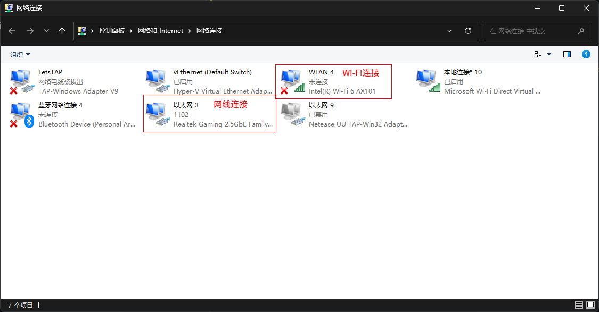
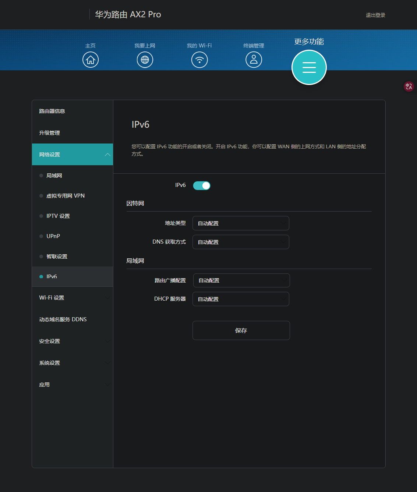
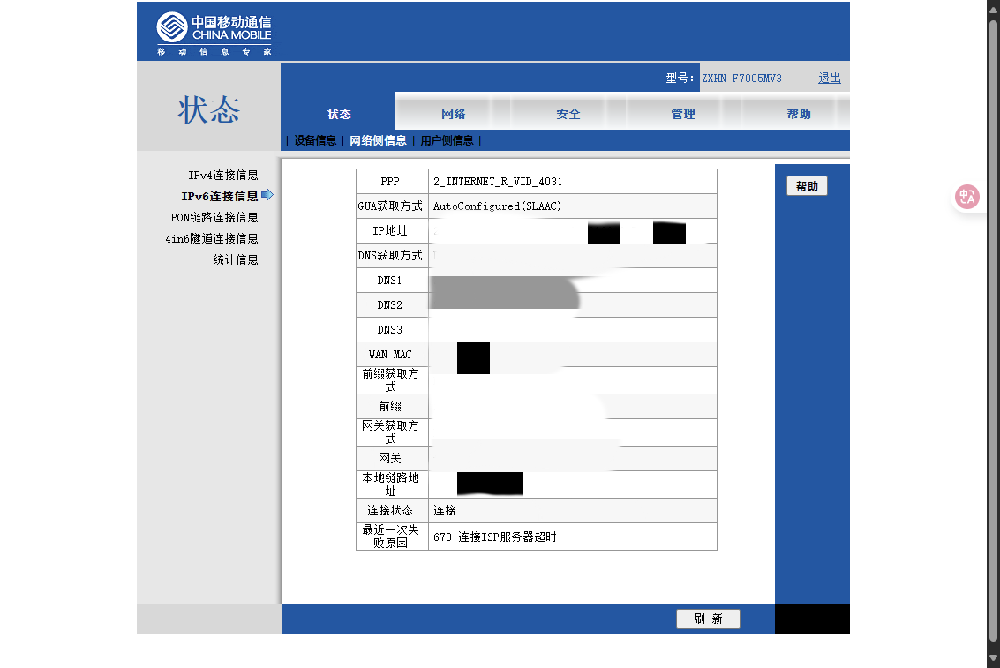

# How to Connect to Spotify and Lyricify Using IPv6  

###### [简体中文](./README.md) / English

> [!NOTE]
> This document was translated by DeepSeek. For feedback or issues, please refer to the original content.

Due to recent unavoidable circumstances, users in mainland China may experience difficulties connecting to Spotify via IPv4.  
Current solutions include using a VPN or configuring IPv6 to access Spotify.  

### Table of Contents  
- [Confirm Network and Hardware Support for IPv6](#confirm-network-and-hardware-support-for-ipv6)  
    - [Hardware Support](#hardware-support)  
    - [Network Support](#network-support)  
    - [Router Configuration](#router-configuration)  
    - [Optical Modem/Direct Cable Connection](#optical-modemdirect-cable-connection)  
- [Prioritize IPv6](#prioritize-ipv6)  
    - [Verify Connectivity](#verify-connectivity)  
    - [Check IPv6 Priority](#check-ipv6-priority)  
- [Force Windows to Globally Prioritize IPv6](/IPv6First-EN.md)  

---

## Confirm Network and Hardware Support for IPv6  

IPv6 requires both network and hardware support to function properly.  

### Hardware Support  

> This section applies to Windows systems.  
> Most modern network adapters support IPv6, but manual configuration may be required.  

1. Open the **Control Panel** → **Network and Internet** → **Network and Sharing Center**.  
2. Click **Change adapter settings** on the left to open the **Network Connections** page.  

  

Locate your active network connection (e.g., **WLAN** for Wi-Fi or **Ethernet** for wired connections).  

Right-click the connection and select **Properties**. Ensure **Internet Protocol Version 6 (TCP/IPv6)** is checked.  
> If this option is missing, your network adapter may not support IPv6. Check your adapter specifications.  

  

---

### Network Support  

After enabling IPv6 on your hardware, test connectivity via websites like http://testipv6.com/.  
If all tests pass, your network supports IPv6. Otherwise, proceed with the following steps.  

> [!WARNING]  
> Do not proceed if using a public network!  

### Router Configuration  
> Example: Huawei Router AX2 Pro. Settings may vary by brand.  

1. Access your router’s admin page (check the router’s label for the address).  
2. Navigate to **Advanced Settings** → **Network Settings** → **IPv6** and enable IPv6.  

  

Save changes. If IPv6 still fails, check your optical modem settings.  

### Optical Modem/Direct Cable Connection  
> Example: China Mobile Optical Modem. Settings vary by ISP.  

For direct connections or unresolved router issues:  
1. Access the modem’s admin page (typically `192.168.1.1`; credentials are on the modem label).  
2. Go to **Status** → **Network Information** → **IPv6 Connection Details**. If no IPv6 data appears, contact your ISP.  

  

> [!NOTE]  
> ISPs now use dynamic admin passwords, rendering older tutorials obsolete.  

Re-test IPv6 connectivity after configuration.  

---

## Prioritize IPv6  

If Spotify/Lyricify remains inaccessible despite IPv6 activation, adjust priority settings.  

### Verify Connectivity  
1. Open **Command Prompt** (`Win + R` → `cmd` → Enter).  
2. Run:  
   ```cmd  
   ping -6 api.spotify.com  
   ping -6 accounts.spotify.com  
   ```  

Successful replies indicate IPv6 connectivity.  

### Check IPv6 Priority  
1. Open **Command Prompt**.  
2. Run:  
   ```cmd  
   netsh interface ipv6 show prefixpolicies  
   ```  
   - Higher "Precedence" values indicate higher priority.  
   - Ensure `::/0` (IPv6) has higher precedence than `::/96` or `::ffff:0:0/96` (IPv4).  

If IPv6 priority is lower, follow the [Force Windows to Globally Prioritize IPv6](/IPv6First-EN.md) guide.<br>
Or use the [one-click script](https://github.com/MiaowCham/How_to_connect_Spotify_with_IPv6/releases/latest).  

> [!note]  
> Settings reset after rebooting. Re-run the script or reapply settings post-reboot.  

If issues persist, double-check all steps to ensure proper IPv6 configuration.  

---

## License  
This document is licensed under **CC0-1.0**.  
You may freely use, modify, and distribute its contents.  